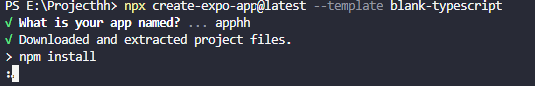
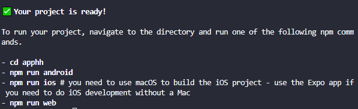
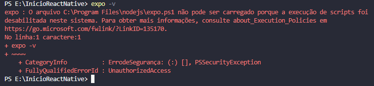
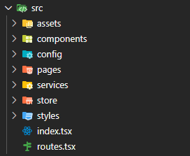
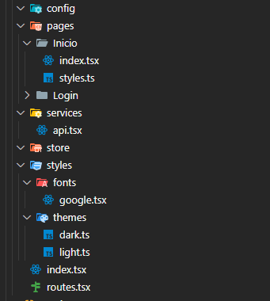
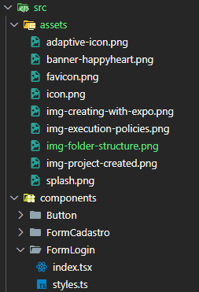

# ❤ Happy Heart Project

<h1>
  
</h1>

## Summary
  - [About](#About)
  - [Stack utilizada](#Stack-utilizada)
  - [Main facilities](#Main-facilities)
  - [Template](#Template)
  - [Tags](#Tags)
  - [Watch](#Watch-out)
  - [Windows user](#Windows-user)
  - [Understand the folder structure of this project.](#Understand-the-folder-structure-ofthis-project)


## About
**Happy Heart Project** is an external work by a healthcare professional who needs an application to help with patient care..


## Stack utilizada

React Native, Expo.

Visual Studio Code.

## Main facilities

- [@How to Install Node.js with NVM on Windows](https://github.com/coreybutler/nvm-windows)

Installing the **version used in this project** of Node.js using cmd
```bash
  nvm install 20.17.0
  nvm use 20.17.0
```

To find out if you have **more** than one version of node.js
```bash
  nvm ls
```

To **uninstall** a specific version of node.js
```bash
  nvm uninstall + version you want
```

Now you will create a react native expo **bare workflow** project with a typescript template
```bash
  npx create-expo-app@latest --template blank-typescript
```
## Template



## Your project is really ready, now it's time to follow the step by step.



## Tags

[](https://choosealicense.com/licenses/apache-2.0/)

## Watch out
### You may have a problem when trying the **npm run web** command 
➡ CommandError: It looks like you're trying to use web support but don't have the required dependencies installed.

## Problem solution 🤓

```bash
  npx expo install react-native-web react-dom @expo/metro-runtime
```

## Windows user
### If you are a **Windows user**, you may have difficulty installing libraries or even run commands.



## Problem solution 🤓

```bash
  Set-ExecutionPolicy -Scope Process -ExecutionPolicy Bypass
```

## Understand the folder structure of this project
### Reference 📕
- [Estrutura de pastas para ReactJS/React Native | Code/Drops #02](https://www.youtube.com/watch?v=X2RKRKdqqwM)



## **src** 
> Ela vai 'abraçar' todo o nosso código, que chamo carinhosamente de **pasta-mãe**. Nela, estarão todas as outras pastas do projeto, como **pages**.

## **pages**
> A pasta em que ficarão as páginas deste aplicativo. Se eu tenho uma página de início, ela é um componente; se tenho uma de login, ela também é um componente. Seguindo essa regra, crio uma pasta para cada componente, em vez de ter vários arquivos **.js, .ts ou .tsx**, pois isso gera confusão visual a longo prazo no desenvolvimento.


> Crie uma pasta que represente a página. Depois, dentro dela, adicione os arquivos **index** e **styles**, sempre separando o index do styles.

## **components**
> Isso serve para qualquer item da sua aplicação que seja comum a todas as páginas, como botões, por exemplo.


## **Exceção da regra**

> Se houver um componente específico de uma página, como um **'esqueci minha senha'** na página de login, é bom tê-lo. Esse componente terá todas as validações para que o usuário possa criar uma nova senha e acessar seu ambiente. Como é um componente único, eu crio na pasta **pages**, dentro de **Login**, a pasta **ForgotModal**.

## **assets**
> Aqui estarão todos os arquivos **estáticos e estruturais** (que fazem parte da estrutura visual da sua aplicação). Qualquer coisa dessa natureza deve ser deixada em assets, mesmo que seja um favicon específico; assim, mantenha tudo em assets.

## **config**
> Alguns plugins...

## **services**
> Em **services**, que também é um tipo de configuração, por exemplo, o **Axios** é um cliente HTTP baseado em promessas para o Node.js, assim como o **Realm**, que é um sistema de gerenciamento de banco de dados de objetos de código aberto, entre outros...

## **store**
> É a parte de configuração para o gerenciamento de estado, como a utilização do **Redux**. É o ponto onde todos os dados da nossa aplicação podem ser acessados e manipulados pelos componentes.

## **routes**
> Serve para a definição de rotas. O roteamento em React é uma técnica usada para **manipular a navegação e o roteamento em aplicativos React**. Ele permite criar várias páginas ou visualizações dentro de um aplicativo de página única (SPA) e define como diferentes URLs devem renderizar diferentes componentes.
- [roteamento React](https://wahyu-ehs.medium.com/react-typescript-template-and-simple-routing-2c25cd405b30)


## **styles** ❤
> A pasta mais divertida até agora! Nela ficarão os estilos comuns (fontes, temas, etc.).

```bash
  export default {
    ColorPrimary: '#',
    ColorSecundary: '#'
}
```
