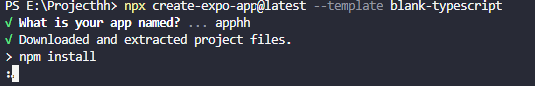
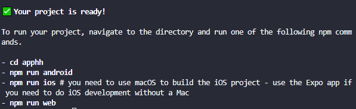
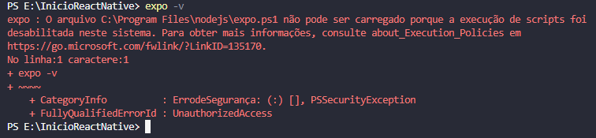

# ❤ Happy Heart Project

<h1>
  
</h1>

## 📖 About
**Happy Heart Project** is an external work by a healthcare professional who needs an application to help with patient care..


## Stack utilizada

React Native, Expo.

Visual Studio Code.

## Main facilities

- [@How to Install Node.js with NVM on Windows](https://github.com/coreybutler/nvm-windows)

Installing the **version used in this project** of Node.js using cmd
```bash
  nvm install 20.17.0
  nvm use 20.17.0
```

To find out if you have **more** than one version of node.js
```bash
  nvm ls
```

To **uninstall** a specific version of node.js
```bash
  nvm uninstall + version you want
```

Now you will create a react native expo **bare workflow** project with a typescript template
```bash
  npx create-expo-app@latest --template blank-typescript
```
## Template



## Your project is really ready, now it's time to follow the step by step.



## Tags

[](https://choosealicense.com/licenses/apache-2.0/)

## ❗❗❗ Watch out!
### You may have a problem when trying the **npm run web** command 
➡ CommandError: It looks like you're trying to use web support but don't have the required dependencies installed.

## Problem solution 🤓

```bash
  npx expo install react-native-web react-dom @expo/metro-runtime
```

## If you are a **Windows user**, you may have difficulty installing libraries or even run commands.



## Problem solution 🤓

```bash
  Set-ExecutionPolicy -Scope Process -ExecutionPolicy Bypass
```
